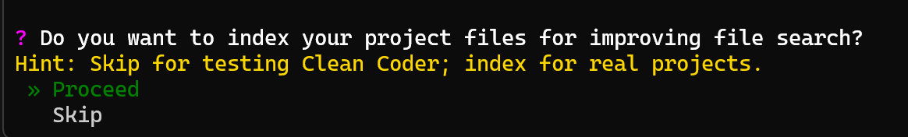

Want your Researcher agent to efficiently find needed elements in even large codebases? 🚀 Enable a Semantic Search (RAG) tool!

Semantic Search tool allows Researcher to find needed elements by semantic queries, e.g. "Find me definition of database endpoints", "Show example of structured output usage".

## Set up

Process of chunking, describing and indexing of codebase Clean Coder will hanle automatically. Just choose "Proceed" when asked during startup.

<strong>💸⏰ Indexing process could be costly and time consuming!</strong>
 
Cost and time of indexing depends on size of your codebase and size of your files. Hopefully we use cheap models for it. Approximately, you can count 1$ per 200 files.

That's all! Now your Researcher has supercharged navigation for big projects. ✨