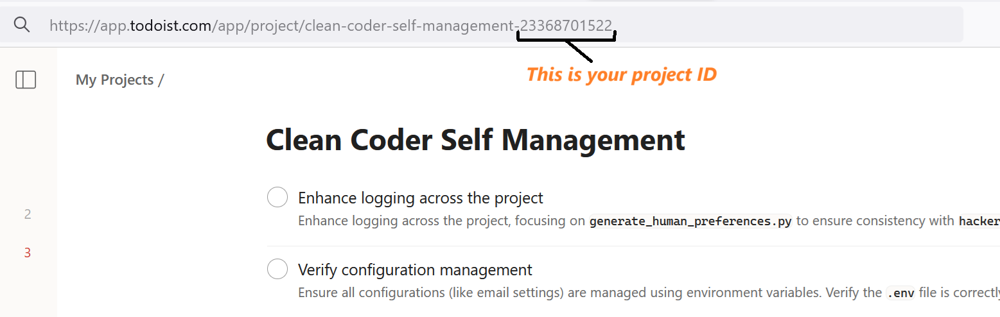
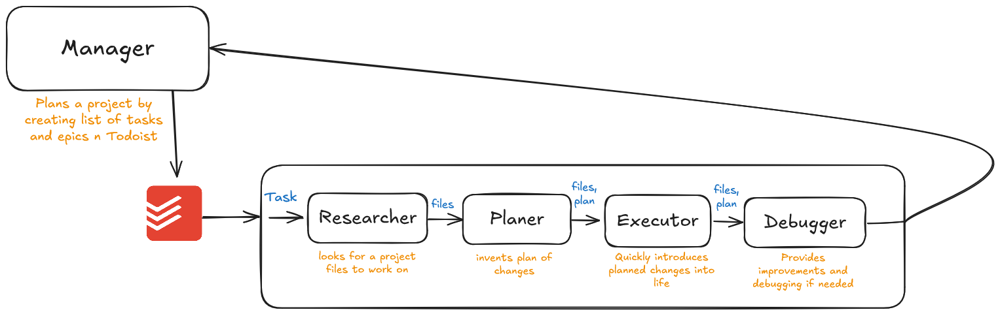

import VideoEmbed from '../../../components/VideoEmbed.astro';

The Project Manager agent in Clean Coder automates task management using Todoist integration. It defines tasks, ensures execution, and handles testing based on project specifications. There is no need to run coding pipeline manually for every task any more!

## Run Manager

within your virtual environment, run:
```
python manager.py
```

## Initial set up

When running Manager for the first time, it will ask you for a few variables, which it saves in the .env file.

First, you need to provide API key(s) for your LLM provider(s). Provide at least one key for [Anthropic](https://www.merge.dev/blog/anthropic-api-key), [OpenAI](https://help.openai.com/en/articles/4936850-where-do-i-find-my-openai-api-key), OpenRouter, or provide the name of your Ollama model if you want to work with a local LLM. However, the more keys you provide the better, as a second LLM could work as a fallback in case of main LLM shortages.

Next, you'll be asked to provide the full path to the directory in which you want to write/modify your code.

You'll also need to provide your [Todoist API key](https://todoist.com/help/articles/find-your-api-token-Jpzx9IIlB) and id of the project.



## Describe your project

At first start, Manager will ask you to write description of your project. Fill it with as many details as possible.

<div style="background-color: #e6f4ea; border-radius: 15px; padding: 25px; margin: 20px 0;">
<strong>🔥 Tips for a Good Project Description:</strong>
<ul>
<li>Provide a clear vision for each feature</li>
<li>Specify if tests and docs should be included</li>
<li>Add any other relevant details that could help the AI understand your project better</li>
</ul>
</div>

You can modify project description at any time by opening `.clean_coder/project_description.txt` file in your project directory.

## Working with Manager

The Manager will create well-described tasks, including the Definition of Done, in your Todoist. For safety, you'll need to approve every task creation, modification, and deletion.

Once the Manager created complete list tasks for your project, it will use the `finish_project_planning` tool. First task from top will enter the programming pipeline.

You will collaborate with the Researcher, Planner, and Executor agents on each task. Completed tasks will be marked as done in Todoist, and you will be asked to provide feedback to the Manager on whether the task was executed well or needs improvements.

This process continues with tasks being executed one after another until the project is finished.



## Demo video

<VideoEmbed videoId="aNpB-Tw-YPw" title="Manager" />

---
Happy coding! 😋
